# MedicineCabinet

 [MedicineCabinet](https://student.agh.edu.pl/~telesins/Apteczka/index.php) is a web application that helps you manage the medicines we have at home. First Aid Kit is a web application that helps you manage the medicines we have at home. You can create a new first aid kit or add yourself to an existing one. It includes functionalities such as displaying contents, consumption, disposal, operation history and cost report. In the following I will try to describe its operation in more detail. 
 
 The project was carried out as part of a course credit at university, therefore the code is in Polish. 
 The project is the result of collaboration with [@JuliaTelesinska](https://github.com/JuliaTelesinska). 

 You can test our MedicineCabinet [here](https://student.agh.edu.pl/~telesins/Apteczka/index.php).

## [Homepage](./index.php) 

This is what the home page looks like. It allows three actions:
<li> log-in
<li> registration with a new cabinet
<li> registration with an existing cabinet
    

    

        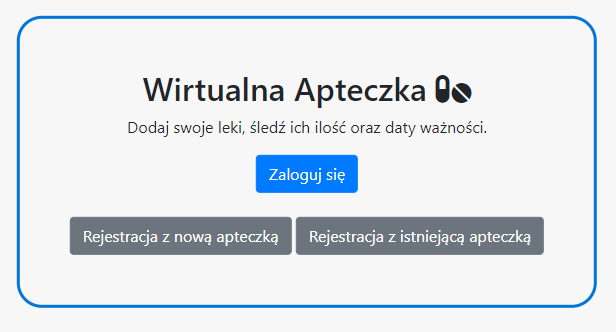
    

 
## [Registration](./rejestracja.php) 

### [Registration with a new cabinet (left view)](./rejestracja_nowa_apteczka.php) 

Registration requires a name, email, password, and the name of your new cabinet. At this point, both the uniqueness of the email and the cabinet name are checked. 

### [Registration with an existing cabinet (right view)](./rejestracja_istniejaca.php) 

Name, email and password are also required here. However, the name of the cabinet can be selected from existing cabinets in the database via a dropout list.

 

    

        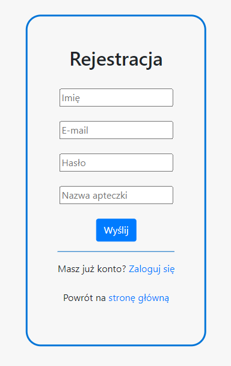
        
    

## [Log-in](./logowanie.php)

You can log in with your registered email and password. 

    

        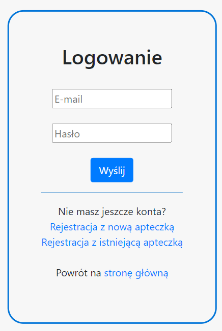
        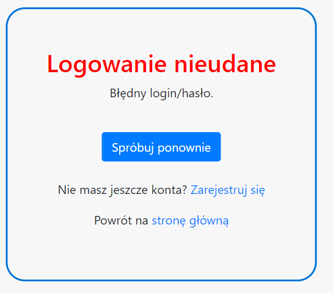
    

## [Homepage](./userpage.php)

Only medications that are past their expiration date are displayed on the home page. You can immediately click "dispose" and remove the drug from the database. 

Below, there are navigation buttons: [cabinet preview](./userBazaLekow.php), [add drug](./dodajlek.php), [drug database](.bazaLekow.php), [operation history](./historia.php), [expense report](./raport_kosztow.php) and [logout](./wyloguj.php).

    

        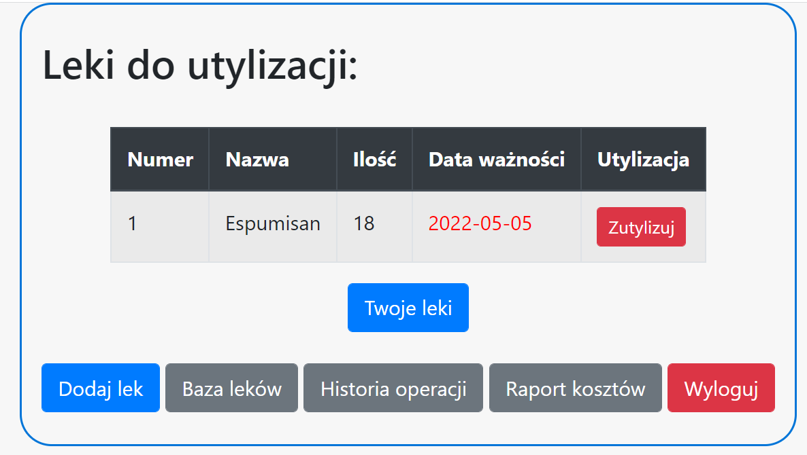
    

## [Drug database](.bazaLekow.php)

The entry of drugs into the medicine cabinet is based on the drug dictionary. Initially it had 20 drugs, but you can still add your drug via the form ("dodaj" button and right view). The drug database contains the name of the drug and the active substance.

    

        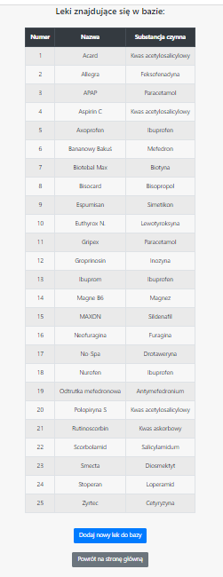
        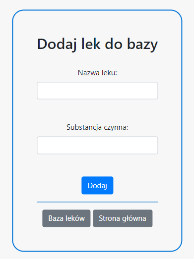
    

## [Cabinet preview](./userBazaLekow.php)

    

        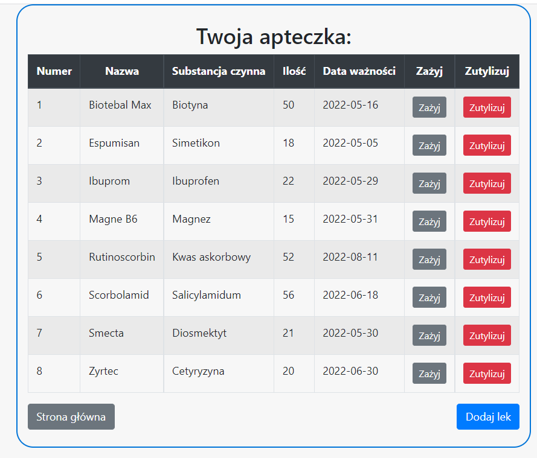
    

## [Add medicine to your medicine cabinet](./dodajlek.php)

    

        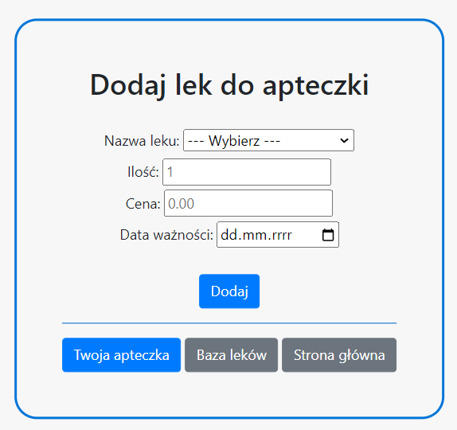
    

## [Take](./zazyj.php) or [dispose](./utylizuj.php) your medicine

    

        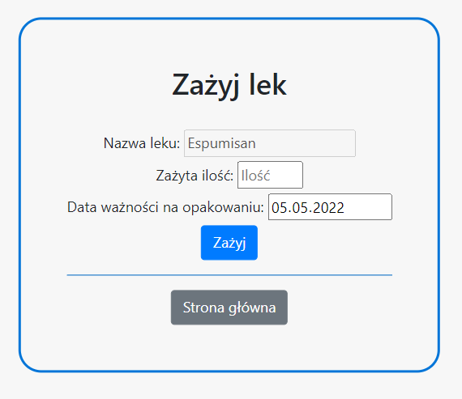
        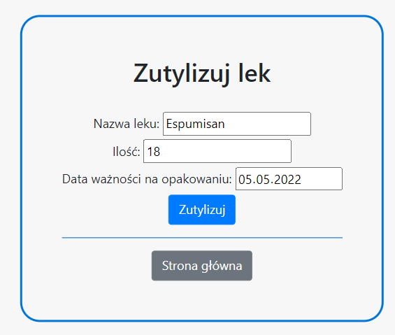
    

## [History](./historia.php)

    

        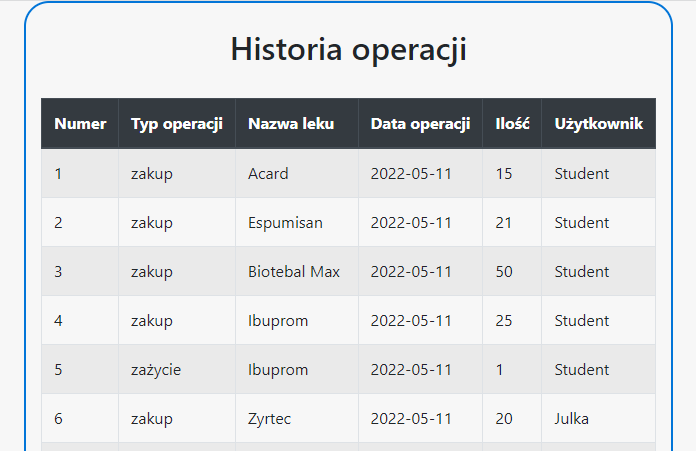
        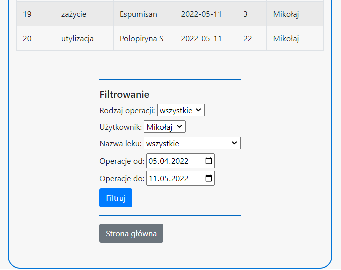
    

## [Expense report](./raport_kosztow.php)

    

        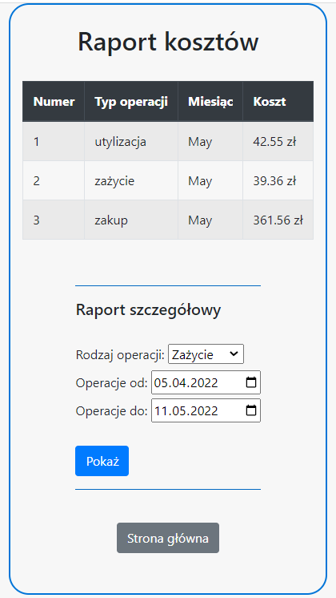
        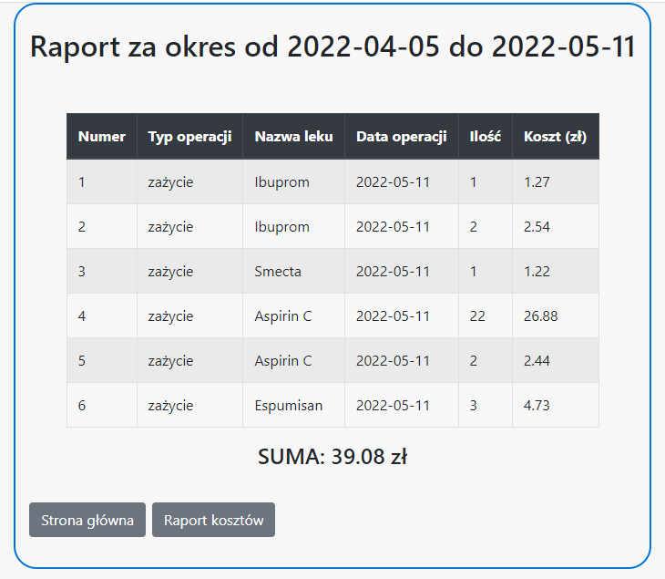
    

## UML Use Case Diagram

    

        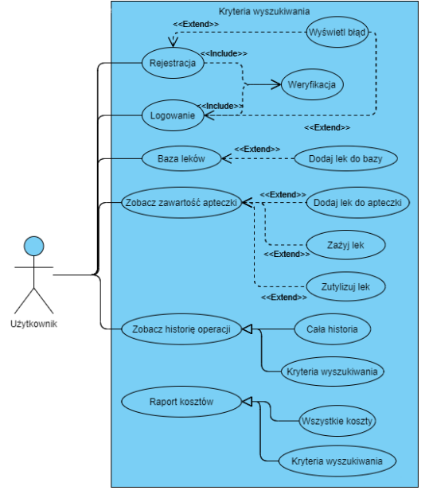
    

## Relational database structure

    

        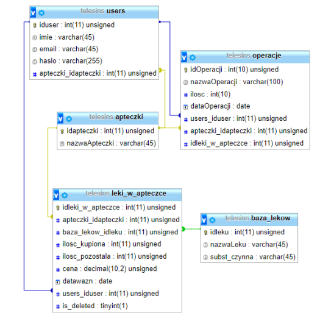
    

## What's next?
At this point the project is working, but there are still a few things that can be improved, for example: 
<li> possibility to have several first aid kits
<li> simplifying adding drugs to the database
<li> prompting the user what medication to take (expiration date) 
<li> different drug quantity format (syrup, drops, ointment)
